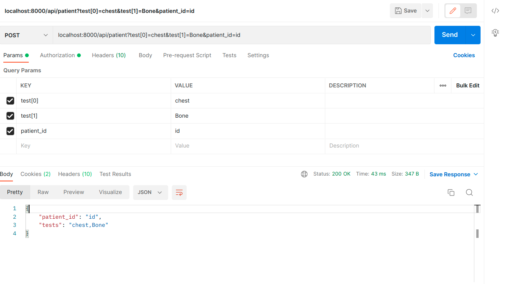

# Installation
Authentication with laravel Sanctum
- Update .env with your environment variables
- Run composer update
- Run `php artisan migrate:refresh --seed` to create and seed the databse
- Start laravel server with `php artisan serve`
- Open the link with your browser

# Actions
All API's were tested with *Postman*
- Go to register route to create new user (e.g `localhost:8000/api/register`)
    - Under Params in postman, create name, email and password then run a *POST* request
    - Copy the Access Token displayed and use it as Authorization Bearer Token
- Registered accounts can also login using their email and password
    - Under Params Tab in Postman, input email and password then run a *POST* request to the `login` endpoint
    - Copy the Access Token displayed and use it as Authorization Bearer Token
- Run a Get request to the endpoint `patient` (e.g localhost:8000/api/patient) to get all types of Test
- Run a Post request to `patient` endpoint to submit patient data 

